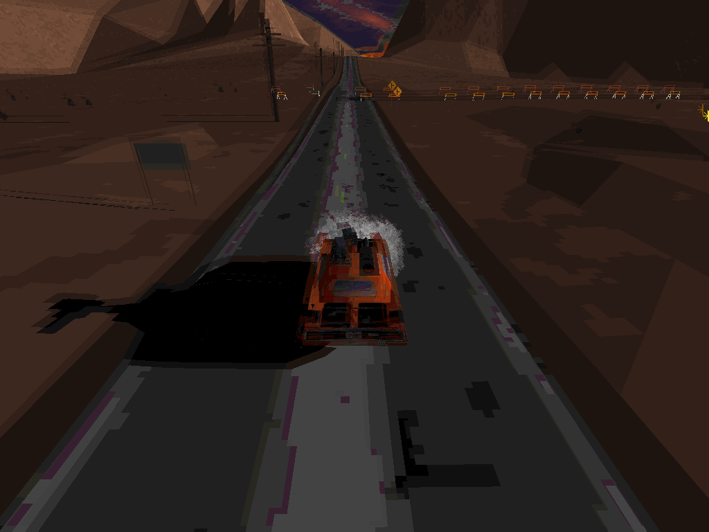
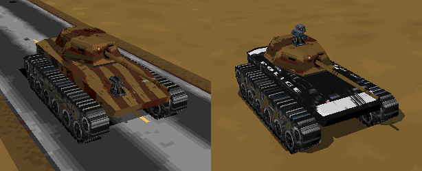
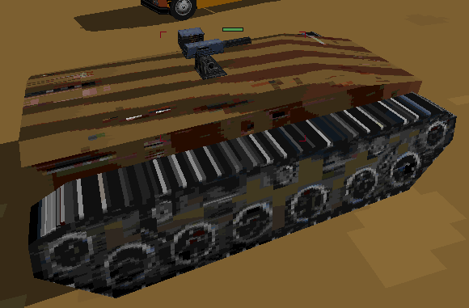
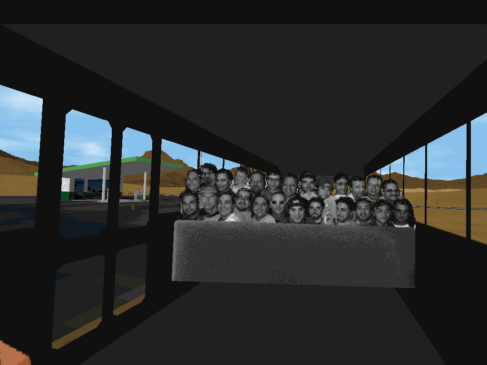

# Interstate '76 Cheat Codes, Easter Eggs, and Miscellany

## Cheat Codes

To enter a cheat code, hold CTRL+SHIFT during a level and type it.

* **blflat**: Destroys the back left tire.
* **brflat**: Destroys the back right tire.
* **flflat**: Destroys the front left tire.
* **frflat**: Destroys the front right tire.
* **getdown**: The mission succeeds when the player's vehicle is destroyed. All other vehicles on the map become hostile (unarmed vehicles will attempt to ram the player) and all mission objectives and event triggers are ignored. Notably, this allows the player to leave the mission area without failing the mission, permitting exploration.
* **wiggleburger**: Applies a "double vision" effect that persists until the game is closed (screenshot below).

  

### Cheat Codes that Don't Work

Some commonly-reported cheat codes don't work.

* **freelance**: Plays one of Taurus' poems. Superfluous since there's a key that performs the same function (C).
* **thirdnostril**: Increases radar targeting range.

## Easter Eggs

* In melee mode, creating and using variants of the Phaedra Rattler with certain names allows the player to use vehicles that are otherwise inaccessible. Note that creation of these Rattler variants can cause the game to crash on the vehicle selection screen; if that happens, delete their `vfratlr*.vcf` files from the game's `ADDON` folder (its default location is `C:/GOG Games/Interstate 76/ADDON`).
  * **knat**: The tank.
    * When created, it's armed with a 30 cal turret (assigned to a forward slot; such slots aren't normally allowed to contain turrets), a 50 cal machine gun, and a special cannon that fires out of the tank turret. In this state the variant is buggy and the 50 cal machine gun usually disappears after it's used once.
    * The special cannon is listed under the name "Empty" in the HUD, but seems to be represented by a blank entry in the variant configuration screen (in the first of the two top weapon slots).
    * The variant can be edited to change its paint scheme (the options are "camouflage" and "police") and weapon loadout.
      * The first top weapon slot (which presumably contains the special tank cannon weapon) cannot be edited.
      * When using the police paint scheme, only the body of the tank, not its turret, will change. This is probably because the turret is treated as a weapon, not part of the vehicle.
      * The 30 cal turret must be removed from the forward slot before saving the variant. Any non-turret weapon can replace it.
    
      
    * If assigned to an AI driver, the tank spawns without its turret and drives much faster.

      
    * Although well-armored, the tank is quite slow. Its unique cannon is powerful but difficult to aim due to the tank's limited speed.
  * **retpocileh**: The Huey helicopter.
    * In the GOG release, always crashes the game when first used. Subsequently the game will crash on the vehicle selection screen until the associated variant file is deleted.

* When presented with the vehicle selection screen before the last story level, click on the helicopter in the top-left to use it.
* While driving the bus, enter cockpit view (press F1) and look back (hold the down arrow key) to see a photo of the development team.

  

## Miscellany

* During a level, press CTRL+ALT+X to make the player's vehicle explode.
* To use a different vehicle during one of the story levels (which are normally limited to the Picard Piranha), create a vehicle variant, then go to the `ADDON` directory and rename its `*.vcf` file to `vppt##.vcf`, where `##` is between `01` and `17` and denotes the story level that should use the custom vehicle.

## TODO

* Update to cover Nitro Pack, particularly the "hotair" and "thetruthishere" Rattler variant names that allow use of the hot air balloon and UFO, respectively.
* I recall being able to drive the tractor (which appears as a civilian vehicle in a few levels) using a Rattler variant named "Farmer John" or something similar, but I've tried this (with and without spaces and backwards) and it doesn't work. I also recall being able to "drive" an armadillo, but I have no recollection of the associated variant name ("ollidamra" doesn't work). Although it's been a while, I'm fairly sure these were supported by the game itself and didn't require hex editing.