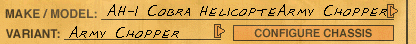
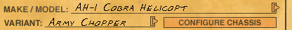
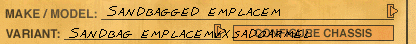

# Interstate '76 and Nitro Pack Vehicle List File Format

## Background

The main directory for both games contains an archive file in ZFS format (`i76.zfs` or `nitro.zfs`). This file contains most of the game's assets, including default vehicle configuration files (VCFs). These VCFs contain the default variants for the various vehicles available to the user as well as variants for the special vehicles.

For example, both `i76.zfs` and `nitro.zfs` contain three VCFs for [the UH-1B Huey helicopter](https://en.wikipedia.org/wiki/Bell_UH-1_Iroquois_variants#UH-1B):

* `vuchuey1.vcf`
* `vuchuey2.vcf`
* `vuchuey3.vcf`

Note that the name of each VCF within a set starts with the set's base name (e.g., `vuchuey`) followed by a unique number. Numbering starts at one, not zero.

The base name of a VCF set is used in the vehicle list files (described below) as the internal name of its corresponding vehicle, although nothing prevents the VCFs within a set from referring to different vehicle definition files (VDFs).

*Incidentally, the ability of VCFs within a set to reference arbitrary VDFs is how the special Phaedra Rattler variants work: using a special variant name causes the game to replace the contents of a VCF that references the Rattler VDF with the contents of a VCF that references the VDF for a special vehicle, but doesn't change the name of the VCF (it still starts with `vfratlr1`, the Rattler base name), allowing it to be selected as a variant of the Rattler.*

## Vehicle Lists

The lists of vehicles available to the user are stored in `*.def` files in the main game directory (note that these files may not be created until the game is run and the associated mode is used). The number of vehicle lists differs between the two games:

* Interstate '76 has a single list:
  * `i76car.def`: vehicles available to the user in all modes.
* Nitro Pack has two lists:
    * `nitcar.def`: vehicles available in Instant Melee mode. Contains 37 vehicles.
    * `nitscar.def`: vehicles available for use in the scenarios. Contains 31 vehicles (six aren't available for some reason).

By default, these lists don't include the special vehicles.

## Vehicle List File Format

Vehicle list files use a simple format.

Offset | Type | Length | Description
---|---|---|---
0 | uint | 4 | The number of vehicles (N<sub>vehicle</sub>).
4 | vehicle entries | 28 * N<sub>vehicle</sub> | The format of each entry is described below.

### Vehicle List Entry Format

Each entry is 28 bytes long.

Offset | Type | Length | Description
---|---|---|---
0 | uint | 4 | Vehicle number. See notes below.
4 | uint | 4 | Total variant count. Updated if the user creates or deletes a variant.
8 | uint | 4 | Default variant count. The number of VCFs in the ZFS file. See notes below.
12 | char | 16 | Null-terminated base name of VCF files for this vehicle.

Notes:

* Vehicle number:
    * Typically increments for each entry relative to the entry before it.
    * Oddly, the same number can be used for multiple entries (in Nitro Pack, the street van and Skeeter's van both have it set to `0x0A`).
* Default variant count:
    * Prevents the user from deleting a variant contained in one of the VCFs within the ZFS file. Attempting to do so displays a "can't delete a default variant" message.
    * When adding a vehicle entry, should be set to the number of VCFs with the associated base name present in the ZFS file.
    * If this value exceeds the number of VCFs in the ZFS file, the user will be prevented from deleting a corresponding number of VCFs in the `addon` directory as well. For example, if set to 5 and there are only 3 VCFs with the associated base name in the ZFS file, the user will be prevented from deleting the first 2 VCFs with the same base name in the `addon` directory.
    * Edge cases:
        * If set to a value that exceeds the total variant count, the last variant is repeated to fill the variant selection list.
        * If set to zero, the variant selection list is empty.
        * In both cases, the total variant count is updated to match.

## Special Vehicles

By examining [the VCFs in Nitro Pack's ZFS file](nitro-vcf-list.md), the information necessary to add the special vehicles to the vehicle lists can be obtained.

Vehicle Name | VCF Base Name | Number of Default Variants
--- | --- | ---
[Armadillo](https://en.wikipedia.org/wiki/Armadillo) | vdillo | 1
Tank | vstank | 3
Hot-air balloon | vubalon | 1
[UH-1B Huey](https://en.wikipedia.org/wiki/Bell_UH-1_Iroquois_variants#UH-1B) | vuchuey | 3
[AH-1 Cobra Helicopte[r]](https://en.wikipedia.org/wiki/Bell_AH-1_Cobra) | vugcobr | 2
[F4D Phantom II](https://en.wikipedia.org/wiki/McDonnell_Douglas_F-4_Phantom_II) | vuphant | 1
Howitzer | vxhowit | 1
Tractor | vxktrac | 1
Sandbagged emplaceme[nt] | vxsndbg | 2
Pole Turret | vxturr | 1
UFO | vxufo | 1

The stationary weapons aren't worth adding because attempting to use them causes the game to crash (see [the **Problems** section](#problems)).

The corresponding bytes to add the remaing vehicles to the end of `nitcar.def` are:

```
24 00 00 00 01 00 00 00 01 00 00 00 76 64 69 6C 6C 6F 00 00 00 00 00 00 00 00 00 00 

25 00 00 00 03 00 00 00 03 00 00 00 76 73 74 61 6E 6B 00 00 00 00 00 00 00 00 00 00 

26 00 00 00 01 00 00 00 01 00 00 00 76 75 62 61 6C 6F 6E 00 00 00 00 00 00 00 00 00 

27 00 00 00 03 00 00 00 03 00 00 00 76 75 63 68 75 65 79 00 00 00 00 00 00 00 00 00 

28 00 00 00 02 00 00 00 02 00 00 00 76 75 67 63 6F 62 72 00 00 00 00 00 00 00 00 00 

29 00 00 00 01 00 00 00 01 00 00 00 76 75 70 68 61 6E 74 00 00 00 00 00 00 00 00 00 

2A 00 00 00 01 00 00 00 01 00 00 00 76 78 6B 74 72 61 63 00 00 00 00 00 00 00 00 00 

2B 00 00 00 01 00 00 00 01 00 00 00 76 78 75 66 6F 00 00 00 00 00 00 00 00 00 00 00
```

The number of vehicles at the start of the file also needs to be updated.

## Problems

There are a few problems associated with the special vehicles.

### Unusable Special Vehicles

The following special vehicles always cause a crash when starting a level:

* The howitzer
* The sandbagged emplacement
* The pole turret

I've omitted them from the ready-to-use modified vehicle lists for this reason. This is no great loss as it's unlikely they'd be much fun to use.

### Melee Mode NPCs Cannot Use Most of the Special Vehicles

In melee mode, the game will crash when starting a level if any NPCs are assigned a special vehicle that flies or is stationary. This means that NPCs can only use the following special vehicles:

* The armadillo
* The tank
* The tractor

Presumably the NPCs that use aircraft and stationary guns in the various scenarios are assigned different AI logic.

### Malformed Name Fields in VCFs

On the vehicle selection screen, the names of the AH-1 Cobra ("AH-1 Cobra Helicopte") and the sandbagged emplacement ("Sandbagged emplaceme") have the name of the selected variant appended to them.




(Note that the emplacement's variant name also contains additional characters; the actual variant name is "Sandbag emplacem", not "Sandbag emplacemvxsadoarmel".)

This seems to be because their names are too long: they take up all 20 bytes used to store a vehicle name within their VDFs, leaving no space for a terminating null byte. Presumably, the variant name from the VCF is stored immediately after the vehicle name from the VDF and the selection screen code continues reading the vehicle name until a null byte is encountered without accounting for the 20-byte limit on name length.

If copies of the VDFs for the cobra (`vuacobra.vdf`) and emplacement (`vxsandbg.vdf`) are put in the `addon` folder (overridding the VDFs in `nitro.zfs`) and edited to replace the last letter of their names with a null byte, this issue disappears.





The emplacement VCFs have a similar issue: their names take up all 16 bytes used to store a name in the VCF and don't leave room for a terminating null byte. As shown above, on the selection screen, their names have the start of the VDF name ("vxsa") appended, followed by several apparently random characters.
