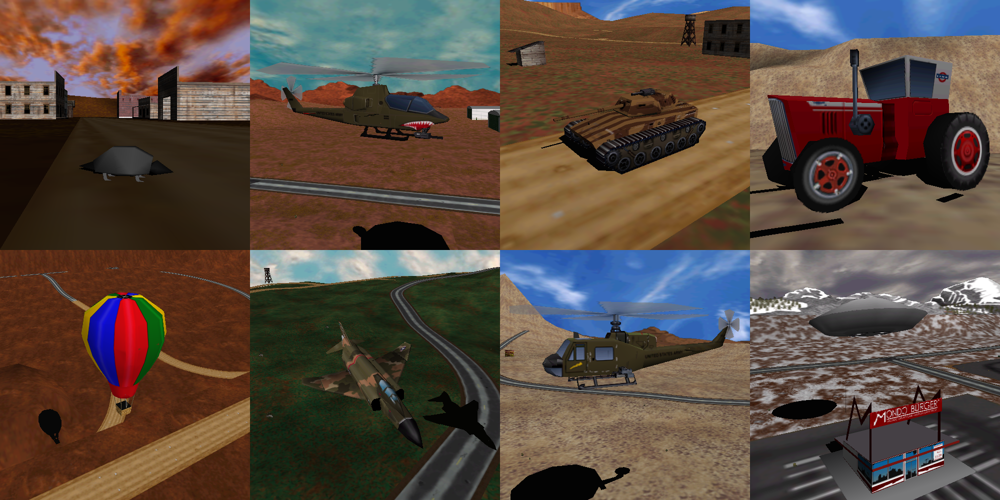
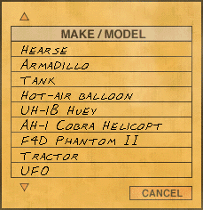
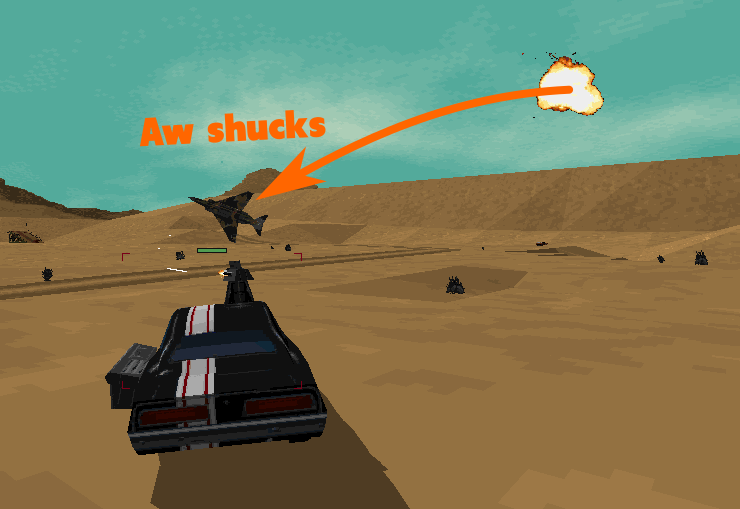

# How to Use Special Vehicles

Both Interstate '76 and Nitro Pack contain special vehicles that appear in some levels as NPCs but aren't available for use by the player.

There are three ways the player can use these vehicles:
1. Create a specially-named variant of the Phaedra Rattler.
    * For example, creating a variant named "knat" allows the player to use the tank. For a full list, see [this document](cheat-codes-and-easter-eggs.md).
    * This is the only method that's supported by the game itself.
    * This method can only be used to access *some* of the special vehicles. For example, there are no variant names for the armadillo or the Cobra helicopter.
2. Extract the vehicle configuration files (VCFs) for the special vehicles from the `i76.zfs`/`nitro.zfs` files in the main game directory, copy them to the `addon` directory within the main game directory, and rename them to make them available as variants of vehicles that are available for use by the player.
    * This is essentially what the special variant name approach does internally.
    * This requires that there be existing VCFs to replace.
3. Modify the list of vehicles available to the player to include the special vehicles.
    * This is the most orderly approach because each special vehicle gets a dedicated entry in the list of vehicles, rather than being accessed by using a special variant of another vehicle.

This document provides the information necessary to implement the third approach.

## Ready-to-Use Expanded Vehicle Lists (Nitro Pack)

I've prepared expanded vehicle lists you can simply copy into the main Nitro Pack directory (`C:\GOG Games\Interstate 76 Nitro Pack` by default if you're using the GOG release).

These lists add the following vehicles to the selection list (note that the variants for these vehicles are contained in `nitro.zfs`):
* [Armadillo](https://en.wikipedia.org/wiki/Armadillo) (1 variant)
* Tank (2 variants)
* Hot air balloon (1 variant)
* [UH-1B Huey helicopter](https://en.wikipedia.org/wiki/Bell_UH-1_Iroquois_variants#UH-1B) (3 variants)
* [AH-1 Cobra helicopter](https://en.wikipedia.org/wiki/Bell_AH-1_Cobra) (2 variants)
* [F-4D Phantom II](https://en.wikipedia.org/wiki/McDonnell_Douglas_F-4_Phantom_II) (1 variant)
* Tractor (1  variant)
* UFO (1 variant)

### Installation

This process will replace the original vehicle lists in the main Nitro Pack directory. **I recommend creating backup copies of the existing `nitcar.def` and `nitscar.def` files first just to be safe**.

* Download [this zip file](special-vehicles.zip) and extract its contents.
    * Alternatively, you can download the modified vehicle lists directly from [here](special-vehicles/files-for-main-program-directory).
* Copy the `nitcar.def` and `nitscar.def` files from the `files-for-main-program-directory` directory to the main Nitro Pack directory.
    * `nitcar.def` and `nitscar.def` contain the lists of vehicles available for melee mode and the scenarios, respectively.

After doing this, the special vehicles will appear in the vehicle selection list.

If you're interested in how the vehicle lists were modified, see [this document](file-format-vehicle-list.md).

## Improved Variants

The special vehicles that fly are rather fragile and don't last long against anything with a turret or guided missiles.

To rectify this, I've edited some of the default variant files (from `nitro.zfs`) for the Cobra and Huey helicopters to substantially increase the amount of armor and chassis reinforcement. Since these are the only flying vehicles that can carry weapons, I didn't bother modifying variants of the others.

To use the modified variants, download [this zip file](special-vehicles.zip) (the same one linked above), extract its contents, and copy all the files in the `files-for-addon-directory` directory to the `addon` directory in the main Nitro Pack directory.

(Alternatively, you can download the files directly from [here](special-vehicles/files-for-addon-directory).)

Note that files in the `addon` directory override files with the same name in the `nitro.zfs` file.

## Problems

### Editing Variants

For most of the special vehicles, attempting to edit an existing variant will cause the game to crash.

### Melee Mode NPCs Cannot Use Most of the Special Vehicles

In melee mode, the game will crash when starting a level if any NPCs are assigned a special vehicle that flies or is stationary. This means that NPCs can only use the following special vehicles:
* The armadillo
* The tank
* The tractor

Presumably the NPCs that use aircraft and stationary guns in the various scenarios are assigned different AI logic.

### Flying Vehicles Cannot Be Used with Some Scenarios

Some scenarios begin with the player's vehicle in a state (e.g., moving quickly on bumpy terrain) that causes a flying vehicle to immediately collide with the terrain and be destroyed.

Any scenario that includes a cutscene in which the player's vehicle normally stops (apparently accomplished by sustained braking) results in a flying vehicle reversing continuously since flying vehicles have no brakes. This typically results in the player's vehicle leaving the mission area (causing the mission to fail mid-cutscene) or colliding with terrain.

## More Information

The vehicle list file format is described in [this document](file-format-vehicle-list.md).
