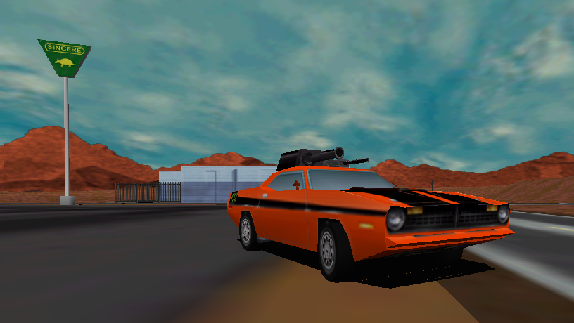
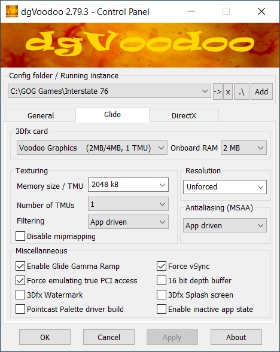
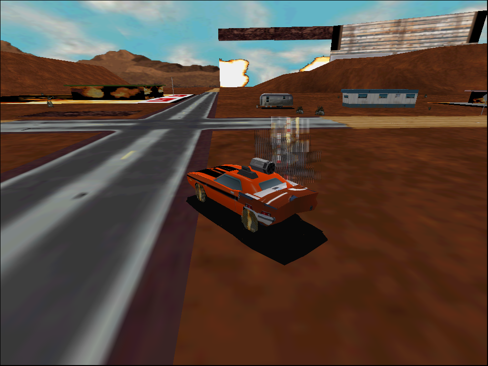

# Running the GOG Release of Interstate '76 Using dgVoodoo 2

This document describes a quick, simple way to get the GOG release of [Interstate '76](https://en.wikipedia.org/wiki/Interstate_%2776) running in Glide mode at an appropriate frame rate using dgVoodoo. This provides improved visual quality via hardware rendering and avoids major bugs that occur when the game runs at a high frame rate.



To get started immediately, jump to [the **Instructions** section](#instructions), below.

## Background

* Interstate '76 uses software rendering by default. It also supports [Direct3D](https://en.wikipedia.org/wiki/Direct3D) and [Glide](https://en.wikipedia.org/wiki/Glide_(API)), with the latter providing noticeably better texture quality than the former.
    * A comparison of the three rendering modes is available in [this video](https://www.youtube.com/watch?v=duMLPJsyVpQ).
* dgVoodoo is a set of libraries that provide wrappers mapping various old graphics APIs (including Glide) to modern versions of Direct3D. It allows games that use these older APIs to run with hardware acceleration on modern versions of Windows and can be used to run Interstate '76 in Glide mode.
* The GOG release of Interstate '76 includes another Glide wrapper called [OpenGLide](https://sourceforge.net/projects/openglide/). Before setting up dgVoodoo, the files associated with OpenGLide should be removed from the game directory as described in [the **Instructions** section](#instructions).
* Interstate '76 contains logic that doesn't account for frame rate ([this article](https://www.informit.com/articles/article.aspx?p=2167437&seqNum=3) explains why this is a problem). When run as-is on modern computers, its frame rate is usually higher than was typical when it was released in 1997. This causes problems in several areas; see [this document](running-interstate-76-gog-release-using-dxwnd.md) for details.

## Instructions

These instructions were tested using version 2.79.3 of dgVoodoo on Windows 10.

1. Install the GOG release of Interstate '76.
1.  Identify the location of the folder containing the Interstate '76 executable. The default is `C:/GOG Games/Interstate 76`.
1. Remove the following OpenGLide files from the Interstate '76 directory:
    * `glide.dll`
    * `glide2x.dll`
    * `glide2x.ovl`
    * `OpenGLid.INI`
1. Download dgVoodoo 2 (available [here](http://dege.freeweb.hu/dgVoodoo2/dgVoodoo2/)). Place the contents of its archive file in a convenient location (no installation is required).
    * You may require a program like [7-Zip](https://www.7-zip.org/) to extract the contents of the dgVoodoo archive file.
    * The dgVoodoo archive contains (among other things) the following notable items:
        * An executable named `dgVoodooCpl.exe`. This program can be used to create and modify dgVoodoo configuration files.
        * A folder named `3Dfx`. It contains subfolders containing Glide wrapper libraries for various processor architectures (32-bit, 64-bit, etc.).
        * A folder named `MS`. It contains subfolders containing Direct3D wrapper libraries for various processor architectures.
1. Copy the following files from the `x86` (32-bit) folder within dgVoodoo's `3Dfx` folder to the game directory:
    * `Glide.dll`
    * `Glide2x.dll`
    * `Glide3x.dll`
1. Copy the following files from the `x86` (32-bit) folder within dgVoodoo's `MS` folder to the game directory:
    * `D3D8.dll`
    * `D3D9.dll`
    * `D3DImm.dll`
    * `DDraw.dll`
1. Run `dgVoodooCpl.exe` (this is the dgVoodoo control panel program).
    * It will be used to create a `dgVoodoo.conf` file within the game directory. This is a plaintext file containing configuration information for the various dgVoodoo wrapper libraries.
1. Click the "Add" button and select the game directory (as noted above, the default is `C:/GOG Games/Interstate 76`).
1. Select the "Glide" tab and configure its settings as follows:
    * 3Dfx card:
        * Card: Voodoo Graphics (2MB/4MB, 1 TMU)
        * Onboard RAM: 2 MB
    * Texturing:
        * Memory size / TMU: 2048 kB
            * Setting this to 2 MB prevents texture mapping errors that have been a problem since the game was released (details in [the **Notes** section](#notes)).
        * Number of TMUs: 1
        * Filtering: App driven
        * Disable mipmapping: unchecked
    * Resolution: Unforced
        * Once you've confirmed that the game works, change this to your desired resolution. To avoid distortion, a 4:3 resolution is recommended.
    * Antialiasing (MSAA): App driven 
    * Miscellaneous:
        * Enable Glide Gamma Ramp: checked
        * Force emulating true PCI access: checked
        * Force vSync: checked
        * All other settings: unchecked
        * Once you've confirmed that the game works, you may wish to adjust these settings (hovering over each one displays a tooltip describing it).
            
1. Click "Apply", then "OK".
1. Navigate to the game directory and confirm that a file named `dgVoodoo.conf` is present.
1. Open the `dgVoodoo.conf` file in the game directory with a text editor (e.g., [Notepad](https://en.wikipedia.org/wiki/Windows_Notepad) or [Notepad++](https://en.wikipedia.org/wiki/Notepad%2B%2B)).
1. Search for "FPSLimit" and set it to 20:
    ```
    FPSLimit                             = 20
    ```
    * This limits the frame rate of the game, which is necessary to ensure correct behaviour. See [the **Notes** section](#notes) for details.
    * The FPS limit is considered an advanced setting and can't be set using `dgVoodooCpl.exe`.
1. Save the changes to `dgVoodoo.conf`.
1. In the game directory, right-click on `i76.exe` and select *Send to > Desktop (create shortcut)*.
1. Locate the shortcut, right-click on it, and select *Properties*.
1. Within the properties window, make the following changes:
    * On the "Shortcut" tab:
        * Add " -glide" (without the quotation marks) to the path in the "Target" field. For example, if the game was installed in the default directory, the target should be:
            ```
            "C:\GOG Games\Interstate 76\i76.exe" -glide
            ```
    * On the "Compatibility" tab:
        * Check "Run this program as an administrator".
        * Click "Change high DPI settings":
            * Check "Override high DPI scaling behavior".
            * Set "Scaling performed by" to "Application".
1. Save the changes to the shortcut.
1. To run the game in Glide mode using dgVoodoo, use the shortcut.


## Notes

### The Mouse Doesn't Work on the Pause Menu

The mouse position isn't properly mapped when using the pause menu in Glide mode. However, the keyboard can be used instead: the arrow keys navigate and pressing enter will select the highlighted item.

### Texture Mapping Problems and the Importance of Setting Memory Size to 2 MB

As noted in the instructions, memory size should be set to 2048 KB (2 MB). This avoids texture mapping problems such as those shown in the screenshot below (taken with memory size set to 4096 KB).



Apparently this was a problem back in the 90s when using actual 3dfx cards with more than 2 MB of memory. (I never personally experienced this; back then I used Direct3D mode as I didn't have a 3dfx card.) For example, in [this thread from 1998](https://groups.google.com/g/3dfx.oem.products.canopus.pure3d/c/MJd-uyb2Ewg), a person named Steve reported:

> I have some problems with the 3dfx version of the I'76 Gold
upgrade. In the first half of the first mission, after blowing up the
fireworks stand, the explosion texture gets mapped to places it
shoudn't be, ie, the sides of buildings, and street signs.

Another user named Craig responded:

> You've probably got the same problem as I (and many others) have with Pure3D and I76 Arsenal. They are not supporting the 4 megs of texture ram, which causes mapping errors and just plain ol' crashes. I got an error box stating "grTexDownloadMipMap: mipmap cannot span 2 MByte boundary". The work around is to run the game (splash.exe) from a .bat file where you "SET
SST_TMUMEM_SIZE=2" which will (apparently) force the card to use only the
first 2 megs of texture ram. Fixed it for me, hope it works for you.

There are a number of other discussions about this issue from the same time period.

### Choice of Frame Rate

In my experience, 20 frames per second yields the best performance (any frame rate between 20 and 30 seems to work reasonably well, but flamethrowers stutter more as the frame rate increases). However, a benefit of using dgVoodoo is that different frame rates can be tried simply by changing the value of `FPSLimit` in the `dgVoodoo.conf` file as described above.

For further discussion of the game's frame rate issues, see [this document](running-interstate-76-gog-release-using-dxwnd.md).

### 4:3 Resolutions May Display with a 16:9 Aspect Ratio

Depending on your graphics hardware and version of Windows, Interstate '76 may display at a 16:9 aspect ratio even when set to a 4:3 aspect ratio in the "Glide" tab of the dgVoodoo control panel program. This is only a display issue, e.g., screenshots of the game will have the correct resolution and aspect ratio.

You may be able to configure your graphics hardware or Windows to properly display resolutions with a 4:3 aspect ratio, but if not, running the game in a window should result in the aspect ratio being correct.

To run the game in a window:

* Open the dgVoodoo control panel program.
* Select the game directory.
* Go to the "General" tab.
* In the "Appearance" panel, select "Windowed".
* Apply the change.

Note that only the 3D parts of the game will run in a window because the menus aren't rendered using Glide. However, within the "Appearance" panel, setting "Scaling Mode" to "Centered" will (for reasons unknown) cause the menu to render at its actual size (640 x 480).

### 16:9 Resolutions are Distorted

When running the game at a resolution with a 16:9 aspect ratio (e.g., 1920 x 1080), the graphics will be distorted (horizontally stretched, to be specific). Presumably the game's underlying camera transformations assume a 4:3 aspect ratio.

Note that if your graphics hardware displays 4:3 resolutions at a 16:9 aspect ratio, this situation will look roughly the same as the one described in the previous section.


## Troubleshooting

### General Troubleshooting

If you're unable to run the game using dgVoodoo as described in this document, there are a few general troubleshooting steps that might be worth trying. I describe them in [this comment](https://github.com/CahootsMalone/interstate-76-stuff/issues/1#issuecomment-1565495913).

### Frame Rate isn't Limited

Some people have reported that dgVoodoo's `FPSLimit` setting doesn't consistently reduce the game's frame rate. [GOG forum user Pseudoman shared one possible solution](https://www.gog.com/forum/interstate_series/simple_stepbystep_instructions_for_running_interstate_76_with_hardware_acceleration_using_dgvood/post7): disabling Windows' "fast startup" feature.

To disable fast startup in Windows 10:

* Open the start menu, click the gear icon to open the settings window, click the "System" button, and select "Power & sleep" from the list of categories on the left.
  * Alternatively, open the start menu, type "power settings", and select "Power & sleep settings".
* Click "Advanced power settings" on the right (under the "Related settings" heading).
* Click "Choose what the power buttons do" in the list on the left.
* Click "Change settings that are currently unavailable".
* Uncheck the box for "Turn on fast startup".
* Click the "Save changes" button.

For reference, Microsoft's documentation describes fast startup [here](https://learn.microsoft.com/en-us/troubleshoot/windows-client/deployment/updates-not-install-with-fast-startup#more-information) as follows:

> The Fast Startup feature in Windows 10 allows your computer [to] start up faster after a shutdown. When you shut down your computer, Fast Startup will put your computer into a hibernation state instead of a full shutdown. Fast Startup is enabled by default if your computer is capable of hibernation.

[This page describing how fast startup can cause hibernation or shutdown to fail](https://learn.microsoft.com/en-us/troubleshoot/windows-client/deployment/fast-startup-causes-system-hibernation-shutdown-fail#more-information) provides slightly more detail:

> During Fast Startup, the kernel session is not closed, but it is hibernated. Fast Startup is a setting that helps the computer start faster after shutdown. Windows does this by saving the kernel session and device drivers (system information) to the hibernate (hiberfil.sys) file on disk instead of closing it when you shut down the computer.
