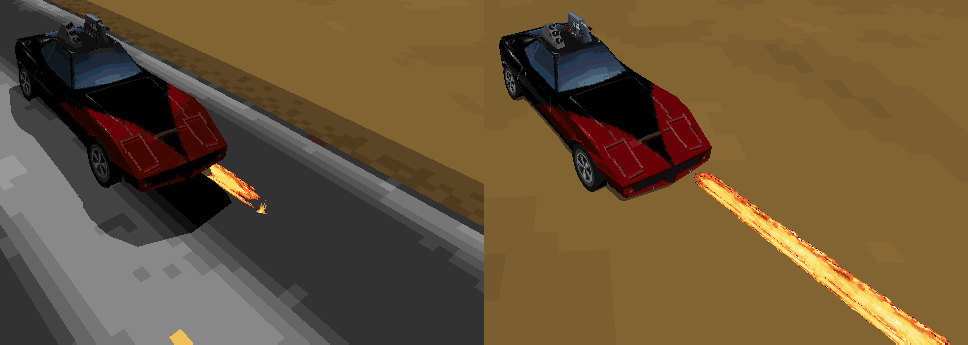

# Running the GOG Release of Interstate '76 Using DxWnd

This document describes a quick, simple way to get the GOG release of [Interstate '76](https://en.wikipedia.org/wiki/Interstate_%2776) running at an appropriate frame rate using DxWnd. This avoids major bugs that occur when the game runs at a high frame rate.

To get started immediately, jump to [the **Instructions** section](#instructions), below.

## Background

* Interstate '76 contains logic that doesn't account for frame rate ([this article](https://www.informit.com/articles/article.aspx?p=2167437&seqNum=3) explains why this is a problem). When run as-is on modern computers, its frame rate is usually far higher than was typical when it was released in 1997. This causes problems in several areas, including:
  * Physics: jump distance is reduced, making certain jumps effectively impossible (notably the one near the end of the fifth story mission), although they can sometimes be completed using nitrous oxide. Among other issues, flamethrowers and mortar weapons don't work properly.
  * AI: computer-controlled vehicles drive slowly and rapidly alternate between steering left and right.
  * Sound: sound effects are sometimes out of sync and get cut off.
* The GOG release of Interstate '76 (available [here](https://www.gog.com/game/interstate76)) runs on modern systems, but doesn't address the frame rate problem. As-is, it runs at more than 100 frames per second on modern computers, which causes the problems described above.
* There are a number of modified executables available that force the game to run at a lower frame rate. However, there isn't universal agreement regarding what frame rate yields the best results and some modified executables introduce new problems (e.g., missing music).
* DxWnd is a program that can be used to run older software on modern versions of Windows (it's primarily intended for use with games). It intercepts system calls and can resolve compatibility issues. Among other functions, it can add a per-frame delay to limit the frame rate at which a game runs.

*Frame-dependent behaviour of the flamethrower. At left, the GOG release of the game running as-is at an average frame rate of 113 FPS. The flamethrower's maximum range is severely reduced and it flickers on and off. At right, running with a frame rate of 20 FPS via DxWnd yields the expected behaviour.*

## Instructions

### Setup

1. Install the GOG release of Interstate '76.
1. Identify the location of the Interstate '76 executable. The default is `C:/GOG Games/Interstate 76/i76.exe`.
1. Download DxWnd (available [here](https://sourceforge.net/projects/dxwnd/)). Place the contents of its archive file in a convenient location (no installation is required).
    * You may require a program like [7-Zip](https://www.7-zip.org/) to extract the contents of the DxWnd archive file.
1. Run `dxwnd.exe`.

    

1. Download the `Interstate-76-GOG-Release.dxw` file contained in this repository by right-clicking [this link](Interstate-76-GOG-Release.dxw) and selecting "Save Link As...". This file contains DxWnd configuration information.
1. In DxWnd, select *File > Import...* and import the `dxw` file you just downloaded. A new target will be created within DxWnd with the name "Interstate 76 (GOG Release)".
    * If no target appears (this is rare but was reported once; the cause is unknown), create the target manually by following the steps in [the **DxWnd Target Configuration** section](#dxwnd-target-configuration), then jump to [the **Running Interstate '76** section](#running-interstate-76).
1. Right-click on the target and select *Modify*.
1. If necessary, update the *Path* field to match the location of the Interstate '76 executable. Click *OK*.

    

1. Click *File > Save*.

### Running Interstate '76

Every time you want to run Interstate '76, perform these steps.

1. Open DxWnd.
1. Double-click on the Interstate '76 target.
1. DxWnd will prompt for adminstrator permissions and restart.
1. Double-click on the Interstate '76 target again. The game should now run and will be limited to 20 frames per second.

Alternatively:

1. Right-click on the DxWnd executable (or a shortcut to it).
1. Select "Run as administrator".
1. Double-click on the Interstate '76 target.

If you're using a shortcut to launch DxWnd, you can configure it to automatically run with administrator permissions as follows (this only needs to be done once):

1. Right-click the DxWnd shortcut and select *Properties*.
1. Select the *Shortcut* tab and click the *Advanced* button.
1. Check *Run as administrator*, then click *OK* twice.

## Notes

### Choice of Frame Rate

In my experience, 20 frames per second yields the best performance (any frame rate between 20 and 30 seems to work reasonably well, but flamethrowers stutter more as the frame rate increases). However, a benefit of using DxWnd is that different frame rates can be tried easily. See [**Changing the Frame Rate**](#changing-the-frame-rate), below.

### Limitations

* Full-screen fade effects (e.g., when the "Somewhere in the southwest..." screen fades to black) are slow, but not intolerably so.
* The game still uses software rendering (texture scaling is performed using nearest-neighbour interpolation). It's possible to enable hardware rendering using a Glide wrapper, but this complicates the setup. Whether or not the increased graphical fidelity justifies the additional complexity is a matter of individual preference. Various approaches are discussed in [the interstate76.com forum](http://forums.interstate76.com/) and [the GOG Interstate '76 forum](https://www.gog.com/forum/interstate_series).

### Changing the Frame Rate

1. In DxWnd, select *Options > Expert mode*.
1. Right-click the Interstate '76 target and select *Modify*.
1. Select the *Timing* tab.
1. In the *Frame\[s\] per second* panel, set the value of the *delay (msec)* field based on the desired frame rate. For a frame rate of N frames per second, the delay equals 1000/N milliseconds (there being 1000 milliseconds in a second).
    * For example, to obtain a frame rate of 24 frames per second, the delay should be set to 1000/24 = 41.666... ≈ 42 milliseconds (DxWnd only allows integer values in the delay field).

    

### DxWnd Target Configuration

For reference, here are the steps I used to create the target for the GOG release of Interstate '76 ([the `Interstate-76-GOG-Release.dxw` file](Interstate-76-GOG-Release.dxw) imported during the setup process).

Note that these steps were performed in version 2.05.61 of DxWnd; they may differ in future versions of DxWnd depending on the default target configuration.

1. Select *Options > Expert mode* (if not already enabled).
1. Select *Edit > Add*.
1. Under the *Main* tab:
    * Set the name.
    * Set the path (`C:\GOG Games\Interstate 76\i76.exe` or wherever `i76.exe` is located on your computer).
    * In the *Generic* panel:
      * Uncheck *Run in window*. (The game won't run with this selected. It's possible additional configuration could resolve this.)
      * Check *Acquire admin caps*.
1. Under the *Timing* tab:
    * Check *Limit*.
    * In the *delay (msec)* field, enter 50 (50 ms gives 1000/50 = 20 frames per second).
1. Under the *Video* tab:
    * In the *Window style* panel, select *default*. (The default value, *thick frame*, causes the game to stop receiving mouse input the second time a level is started; a window frame also appears when this happens.)
1. Click *OK*.
1. Select *File > Save*.

### Miscellaneous

* DxWnd comes with a target configuration file for Interstate '76 (in the `exports` folder), but it doesn't work with the GOG release.

