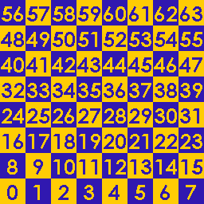
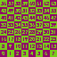
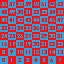
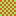
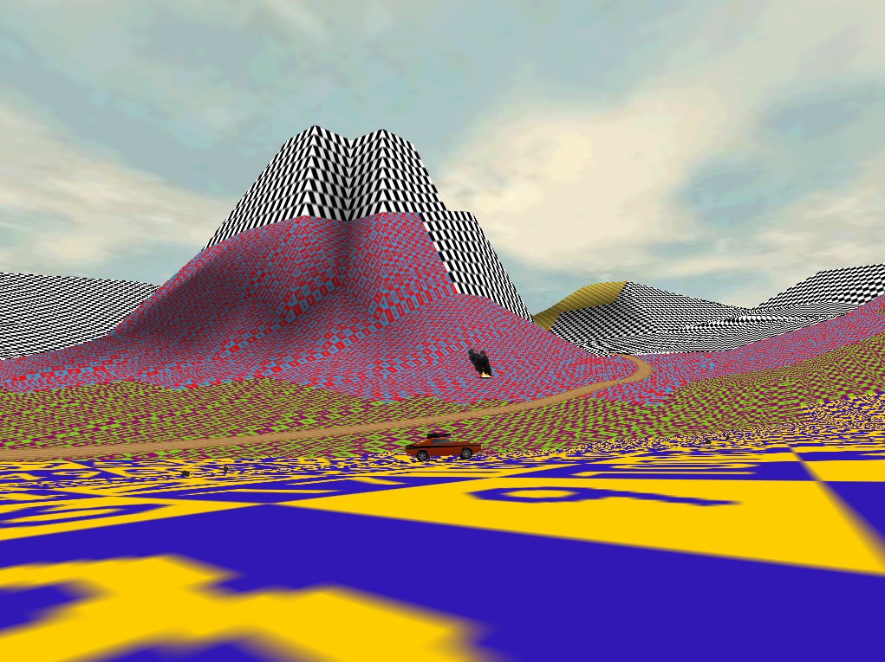
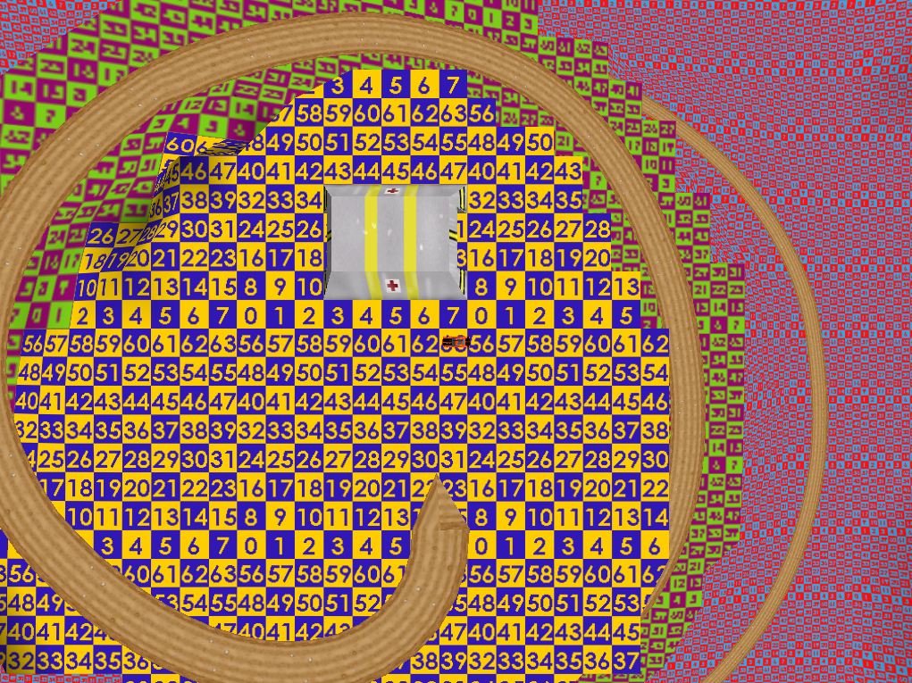
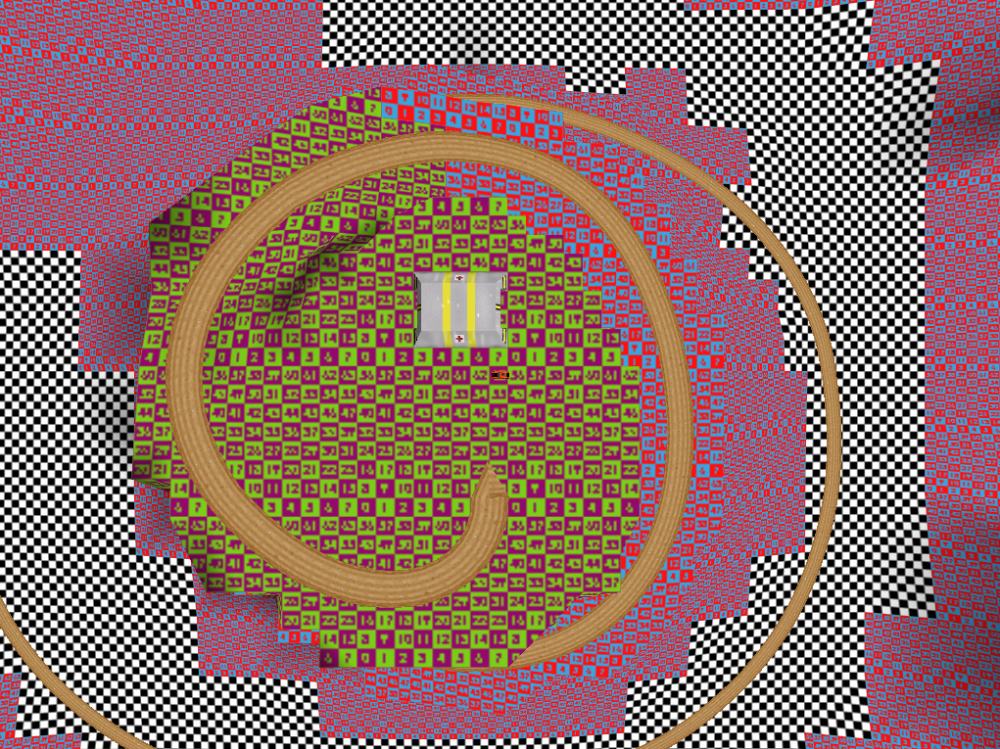
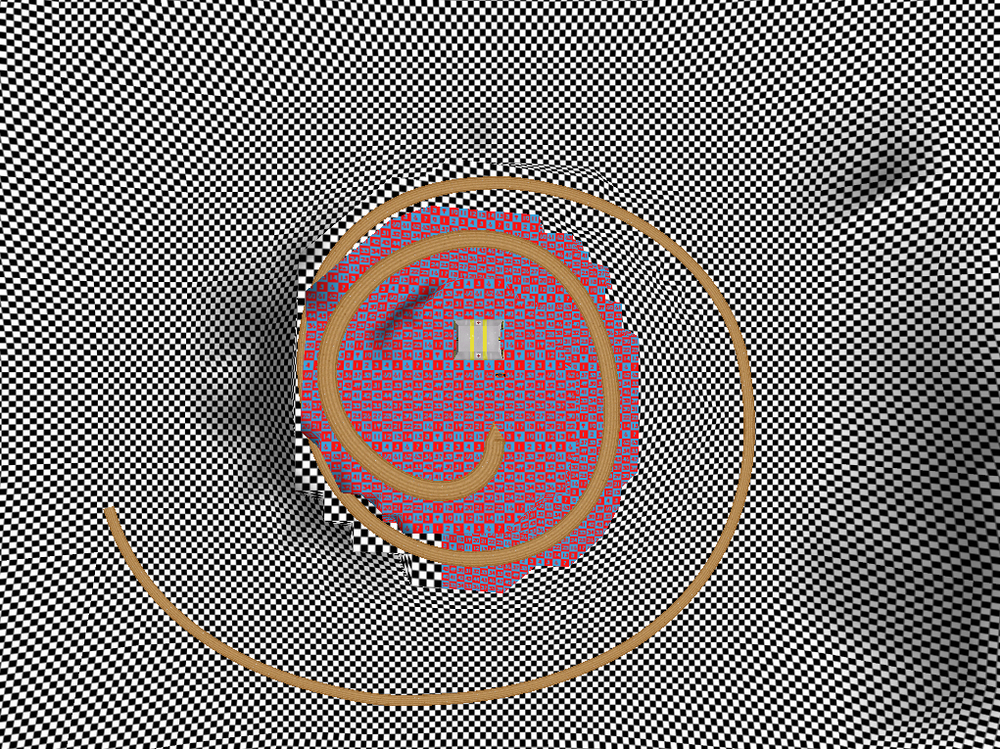
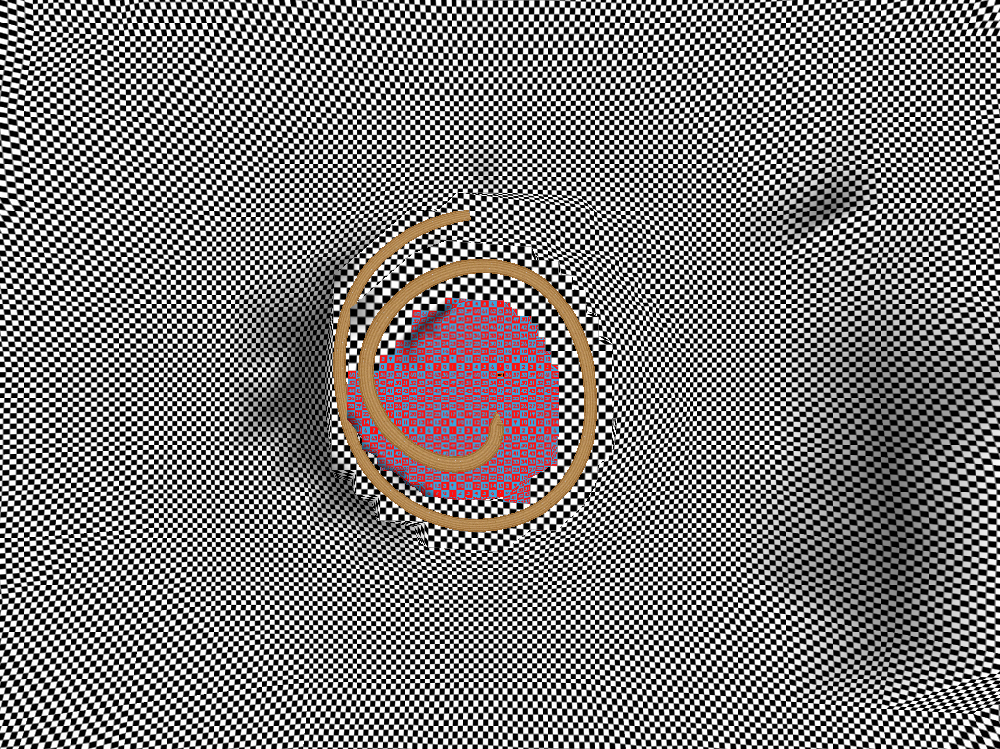
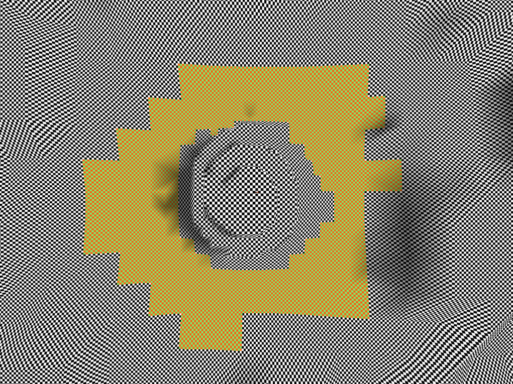

# Terrain Texture Info

* Within Interstate '76's `zfs` archive file, there are many different types of files, including:
  * `map`: basic textures consisting of a list of per-pixel indices into the current colour palette.
  * `m16`: same as `map` files, but with an additional, relatively short section of unknown significance following the palette indices. Starts with four bytes for width, three bytes for height, and one byte containing an offset into the colour palette that will be added to indices.
  * `vqm`: textures using tile-based compression. Consists of a list of two-byte indices. Each index accounts for a 4x4 pixel area within the texture and points to either a colour within the current palette (which will be used to fill a 4x4 area) or a 4x4 tile within a `cbk` file.
  * `pak`: an uncompressed collection of related files in sequence. Many different types of files are stored within `pak` files, including sets of textures.
  * `pix`: index for a `pak` file. Lists the number of files within the `pak` file and, for each file, its name, offset, and size. Oddly, `pix` files are ASCII plaintext.
* Level files refer to terrain texture files using a `map` extension, but terrain textures are stored in `pak` files and have either a `vqm` (textures for software rendering mode) or `m16` (hardware mode textures) extension.
  * For example, the `miss16` (hardware rendering) version of multiplayer map Jorczak's Peak (`M14.MSN`) has its terrain texture set to `tp181sw6.MAP`, which the game interprets this as a reference to multiple textures contained within `tp18m6.pak`. The first texture within `tp18m6.pak` is named `TP181SW6.M16`.
* For each terrain texture set, there are two pairs of `pix` and `pak` files: one for software textures and one for hardware textures. The files for hardware textures have "6" appended to the file name. For example, `tp18m.pix/pak` for software and `tp18m6.pix/pak` for hardware.
* Example terrain texture `pix` file: `tp18m6.pix` contains a directory for `tp18m6.pak`:
    ```
    6
    TP181SW6.M16 0 278
    TP182SW6.M16 278 65570
    TP183SW6.M16 65848 4122
    TP184SW6.M16 69970 4122
    TP185SW6.M16 74092 1046
    TP186SW6.M16 75138 278
    ```
* Terrain texture `pak` files contain [mipmaps](https://en.wikipedia.org/wiki/Mipmap), i.e., versions of the same texture at different sizes, with smaller textures being used for faces that are further from the camera.
  * In order, the textures in a terrain `pak` file are 16x16, 256x256, 64x64, 64x64, 32x32, and 16x16 pixels in size.
  * The first 16x16 texture doesn't appear to be used.
  * I don't know why there are two 64x64 textures; I would've expected a 128x128 texture in place of the first 64x64 texture. Both are used.
* Terrain textures are mapped to an area covering 64 heightmap tiles.
* I wrote [a short Python script](scripts/terrain-texture-generation/generate-interstate-76-map-checkerboard-with-numbers.py) to generate five checkboard textures and replaced the textures in `tp18m6.pak` (except the first, unused 16x16 texture) with them. (This was originally motivated by a desire to better see how the heightmap deforms with distance.) The textures:
    * 256x256:

        
    
    * 64x64 (first):

        
    
    * 64x64 (second):

        
    
    * 32x32 (numbers omitted due to small size of texture):

        
    
    * 16x16 (again, numbers omitted):
        
        

Because it contains a relatively large range of terrain heights, Jorczak's peak provides a good demonstration of the different mipmap textures being used for terrain faces at various distances from the camera. The screenshots below were taken with the terrain clipping distance (specified within the world definition section of the level file) increased from 600 to 1000 to ensure that terrain sufficiently far from the camera for the 16x16 texture to be used wasn't culled.









Beyond a certain distance, objects (like the respawn bunker at the top of the hill) and road segments are culled.




